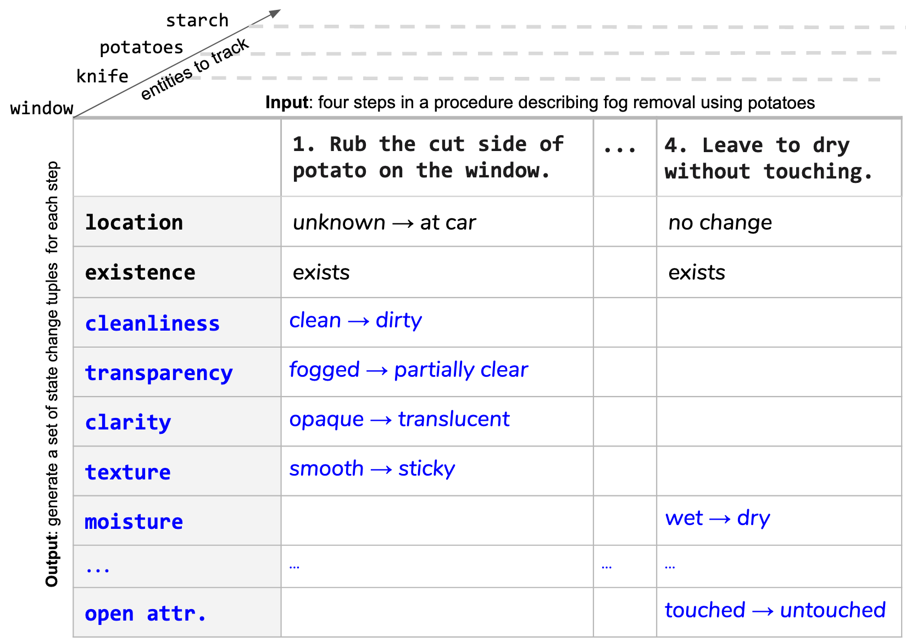

# OpenPI: Open-Domain Procedural Inference
OpenPI dataset for tracking entities in open domain procedural text
(EMNLP 2020).

For [OpenPI2.0](https://arxiv.org/pdf/2305.14603.pdf), go to [v2.0](/v2.0).



`Paper`: 
https://www.aclweb.org/anthology/2020.emnlp-main.520.pdf

`Project page`: https://allenai.org/data/openpi

## Dataset

OpenPI Dataset files are available in JSON format under `openpi-dataset/data/gold/` . There are four files:
  - `id_question.jsonl`: each line is a json with an id, and the input sentence and its past sentences i.e., "x"
  - `id_question_metadata.jsonl`: the metadata corresponding to the question such as topic. Each line is a json with an id, and the metadata
  - `id_answers_metadata.jsonl`: each line is a json with an id, and the a list of answers i.e., "y"
  - `id_answers.jsonl`: the metadata corresponding to the answer. Each line is a json with an id, and the metadata (such as entity, attribute, before value, after value).


## Training 

You can modify the hyperparameters in this script to train the model.
```
sh scripts/training_bash.sh
```

## Run Prediction

To run predictions on a single file:
```
python src/model/generation.py \
      --model_path /path/to/trained_model \
      --test_input_file /path/to/input_file \
      --unformatted_outpath /path/to/store/unformatted_predictions \
      --formatted_outpath /path/to/store/formatted/predictions \
      --max_len max_len_say_200
```

To run predictions on multiple files, you can use this bash script:
```
sh scripts/predictions_bash.sh
```

## Run Evaluation

```
python eval/simple_eval.py 
    -g data/gold/test/id_answers.jsonl
    -p /path/to/formatted/predictions 
    --quiet
```
(no diagnostics file generated when using --quiet)

To run evaluation on multiple files, you can use this bash script:
```
sh scripts/evaluations_bash.sh
```

## Hyperparameters
To match the results published in the paper, please use the following hyperparameters.
https://github.com/allenai/openpi-dataset/blob/main/hyperparams.md

## Leaderboard

coming soon... (we are now working on openpi v2 which clusters 

## Citation

If you use this dataset in your work, please cite:
```
@inproceedings{tandon-etal-2020-dataset,
    title = "A Dataset for Tracking Entities in Open Domain Procedural Text",
    author = "Tandon, Niket  and
      Sakaguchi, Keisuke  and
      Dalvi, Bhavana  and
      Rajagopal, Dheeraj  and
      Clark, Peter  and
      Guerquin, Michal  and
      Richardson, Kyle  and
      Hovy, Eduard",
    booktitle = "Proceedings of the 2020 Conference on Empirical Methods in Natural Language Processing (EMNLP)",
    month = nov,
    year = "2020",
    address = "Online",
    publisher = "Association for Computational Linguistics",
    url = "https://www.aclweb.org/anthology/2020.emnlp-main.520",
    doi = "10.18653/v1/2020.emnlp-main.520",
    pages = "6408--6417"
}
```
