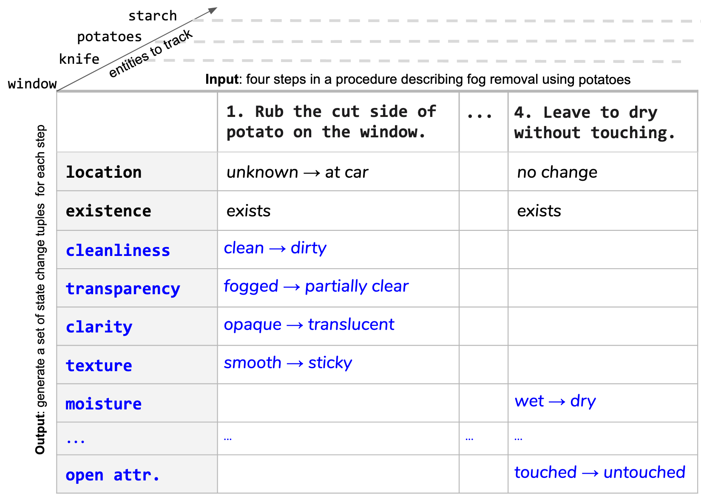

# OpenPI: Open Procedural Inference
OpenPI is a dataset for tracking entities in open domain procedural text.



OpenPI has two versions - see more details in `/v1.0` and `/v2.0`.

`Papers`: 
- V1.0: https://www.aclweb.org/anthology/2020.emnlp-main.520.pdf
- V2.0: https://arxiv.org/abs/2305.14603

`Project page`: https://allenai.org/data/openpi

## Citation

If you use this dataset in your work, please cite:
```
@inproceedings{tandon-etal-2020-dataset,
    title = "A Dataset for Tracking Entities in Open Domain Procedural Text",
    author = "Tandon, Niket  and
      Sakaguchi, Keisuke  and
      Dalvi, Bhavana  and
      Rajagopal, Dheeraj  and
      Clark, Peter  and
      Guerquin, Michal  and
      Richardson, Kyle  and
      Hovy, Eduard",
    booktitle = "Proceedings of the 2020 Conference on Empirical Methods in Natural Language Processing (EMNLP)",
    month = nov,
    year = "2020",
    address = "Online",
    publisher = "Association for Computational Linguistics",
    url = "https://www.aclweb.org/anthology/2020.emnlp-main.520",
    doi = "10.18653/v1/2020.emnlp-main.520",
    pages = "6408--6417"
}

@misc{zhang2023openpi20,
      title={OpenPI2.0: An Improved Dataset for Entity Tracking in Texts}, 
      author={Li Zhang and Hainiu Xu and Abhinav Kommula and Niket Tandon and Chris Callison-Burch},
      year={2023},
      eprint={2305.14603},
      archivePrefix={arXiv},
      primaryClass={cs.CL}
}
```
