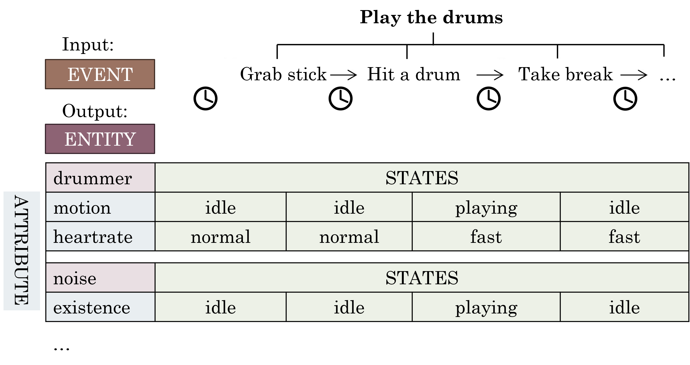
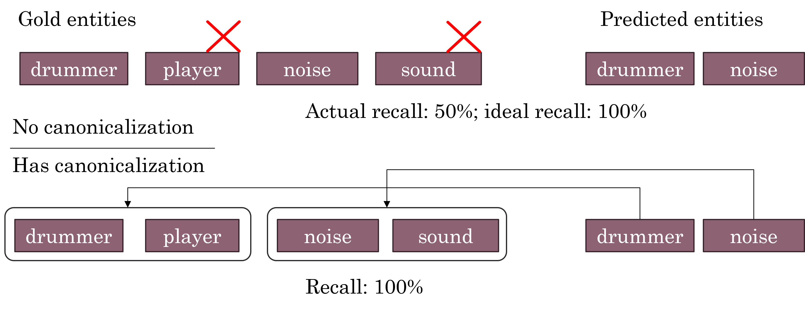
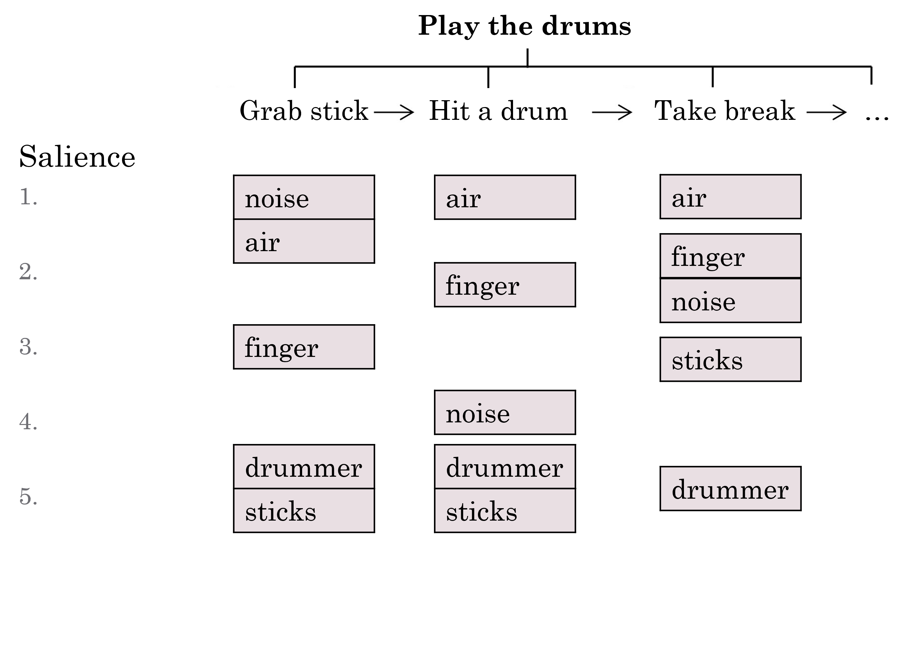

# OpenPI2.0

The original [OpenPI dataset](https://github.com/allenai/openpi-dataset) is one that trains and evaluates models to predict entity states throughout a procedure.


The goal of **OpenPI2.0** is to augment in the following aspects:
- Canonicalization: cluster entities and attributes with the same meaning;

- Salience: add automatic and manual labels of entity salience.


With these features, OpenPI2.0 facilitates work on entity state tracking. It leads to fairer evaluation (by reducing false negatives during prediction) and better downstream performance (by allowing filtering by entity salience).

## Canonicalization
The resulting data file with entity and attribute clusters is `data/dev-data-reformatted-v4.json` for the development set. Those for the train and test sets are coming soon.

To create this data, we start with `data/dev-ranked.json` which is the original OpenPI data and perform canonicalization. See the README in `source/cluster` for more details on this.

The canonicalized OpenPI2.0 can evaluate entity state trcking more fairly. To get model predictions:
- Running `source/predict_schema.py --model MODEL --prompt 1|2` and `predict_states.py --model MODEL` produces predictions for the schemata subtask and the states subtask. The output is for example `data/dev_schema_chatgpt_1.json`. The prompt type 1 corresponds to predicting entities and attributes individually, while the prompt 2 corresponds to the combined prediction of an entire sentence (attribute of entity was pre-state before and post-state after) just like the original OpenPI evaluation.
- Running `source/evaluate_schema.py --model MODEL [--og]` or similarly `evaluate_states.py` and `evaluate_combined.py` performs evaluation of the above settings. `--og` specifies to use the over-generated and expanded clusters for a fairer exact match evaluation.

## Salience
We provide both human-annotated and LLM-predicted entity salience labels.

For human-annotated labels:
- `data/dev-data-reformatted-v4_votes_salience_1-20.json` contains human annotations by human A
- `data/dev-data-reformatted-v4_votes_salience_1-20_human2.json` contains human annotations by human B

For LLM-predicted labels:
- `data/dev-data-reformatted-v4_pred-salience.json` contains LLM-predicted salience scores
- This file is produced by running `source/predict_salience.py --model MODEL`

To evaluate the salience labels by correlation:
- Running `source/evaluate_salience.py` calculates correlation among the above scores.
- Running `source/plot_correlation.py` plots a bar chart of correlations for the first 20 procedures in the development set.

## Tool to Predict Entity States and Salience
The above data might be used to select models (e.g., tune prompts) to predict both entity states and salience. In `api/`, we provide such a model by prompting OpenAI GPT models. See `api/README.md` for more details. 

## Citation
If you find our work helpful, please cite
```
@misc{zhang2023openpi20,
      title={OpenPI2.0: An Improved Dataset for Entity Tracking in Texts}, 
      author={Li Zhang and Hainiu Xu and Abhinav Kommula and Niket Tandon and Chris Callison-Burch},
      year={2023},
      eprint={2305.14603},
      archivePrefix={arXiv},
      primaryClass={cs.CL}
}
```
